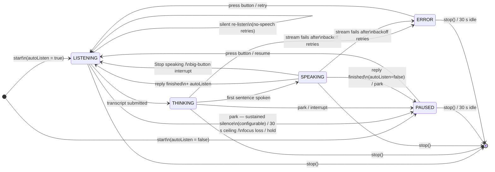

# Chirp — Notification & Session State Model

The notification is a **projection of `SessionController.state`** (`StateFlow<SessionState>`), rendered by `ConversationNotification` and driven by `ConversationService`. There are two kinds of cards:

1. **Active-session card** — an ongoing, silent foreground-service notification shown while the voice loop is live.
2. **Standby prompt** — a regular "Continue conversation?" notification posted when the session parks (mic off) so the user can cheaply resume — auto-dismissed after 5 minutes.

## Session state machine (core loop

**`IDLE`** is what the controller resets to on `stop()`; the active card is removed
at that point, so IDLE is never a visible notification state.

## How the notifications interact with the state

### Active-session card (ongoing, FGS

| `SessionPhase` | Card title | Card content | Actions | Mic |
|---|---|---|---|---|
| *(startup)* | Starting… | Starting… | — | off/starting |
| `LISTENING` | Listening… | `“<partial transcript>”` or **Listening…** | Stop | **on** |
| `THINKING` | Thinking… | partial response or **Waiting for the model…** (+ chronometer) | Stop | off |
| `SPEAKING` | Speaking… | partial response or **Speaking…** | **Stop speaking**, Stop | off |
| `PAUSED` (from active turn) | — | *(immediately hands over to the standby prompt)* | — | off |
| `PAUSED` (auto-listen=false start) | Chirp | **Tap the mic to continue.** → auto-stop after 30 s | Stop | off |
| `ERROR` | Connection problem | `errorMessage` → auto-stop after 30 s | Stop | off |

The card is rebuilt in place (`NOTIFICATION_ID = 1001`, throttled to 300 ms while
streaming), always `.setOngoing(true)` + silent, on the `IMPORTANCE_LOW` channel.

### Standby "Continue conversation?" prompt (regular notification

Posted by `ConversationService.stopSession(showStandby = true)` when the loop parks
**from an active turn** — 30 s of capped listening, audio-focus loss, or
headset-hold. The foreground service is fully torn down first (`stopForeground(REMOVE)` +
`stopSelf`), so the mic (and its green indicator) is off during the prompt..

| Property | Value |
|---|---|
| Title / content | **Continue conversation?** / "Tap to resume your voice session." |
| **Resume** action | `PendingIntent.getForegroundService(ACTION_START + conversationId)` → restarts the FGS and controller on the **same conversation** |
| **End** action | Broadcast to `StandbyTimeoutReceiver` → cancels the prompt + `controller.stop()` (ends any parked session) |
| Auto-dismiss | `AlarmManager` one-shot ore 5 min (`STANDBY_TIMEOUT_MS`) → same receiver → prompt removed + session ended |
| Swipe | Dismissible (`setOngoing(false)` + `setAutoCancel(true)`) |

**Why a resume is "a fraction longer" than a press-while-parked:** the controller
session was ended at the park point, so resuming is a fresh (fast) cold start on
the same `conversationId` rather than a wake-up of a hot loop..

## Key invariants

- The notification can never *lie* about the mic: `contentFor()` shows the phase's
  real default (e.g. "Listening…") instead of a stale "Tap to open the
  conversation."; the first FGS card is a neutral **"Starting…"** until the
  controller's post-start state lands..
- Android requires a foreground service to show a notification for its whole
  lifetime — so "notification gone" ⇔ "session over"/standby handover; there is
  no way to keep a session alive with no card..
- Listening never stays hot forever, enforced by the app itself rather than
  trusted to the on-device recognizer. `ConversationService`'s
  `LISTENING_SILENCE_TIMEOUT_MS` (30 s) is a fixed, non-resettable ceiling
  anchored to when `LISTENING` is entered — the last-resort backstop behind
  `SessionController`'s own primary silence watchdog. See
  [`listening-timeout.md`](listening-timeout.md) for the full design
  (what counts as "silence," why it's a two-layer setup, and known
  limitations).
- The standby prompt never outlives 5 minutes; End, swipe, or the alarm all
  end the parked session state in the controller too..